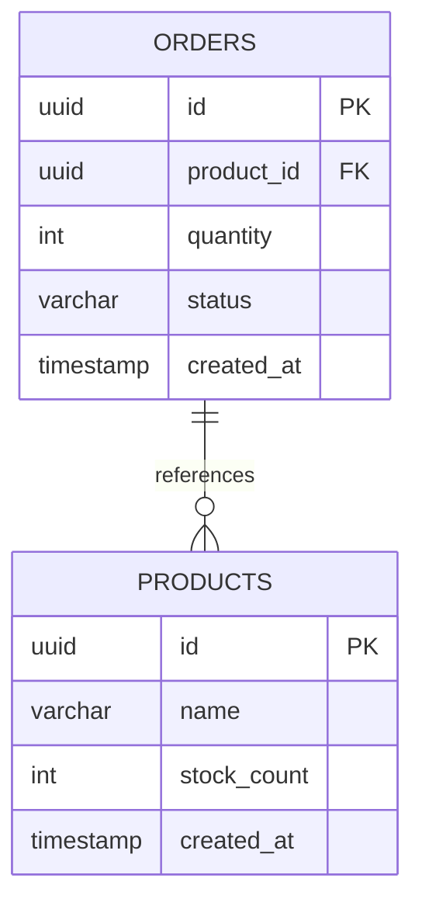

# feat: Order & Product Microservices Implementation

## Overview

Implement two Spring Boot 4 microservices demonstrating event-driven architecture with Kafka and REST communication.

| Service | Port | Database | Role |
|---------|------|----------|------|
| Order Service | 8081 | orderdb (5432) | Kafka Producer, REST Client |
| Product Service | 8082 | productdb (5433) | Kafka Consumer, REST API |

## Problem Statement / Motivation

This project serves as a reference implementation for:
- Microservices architecture with Spring Boot 4.x
- Event-driven communication using Apache Kafka
- Service-to-service REST communication
- Database-per-service pattern with PostgreSQL

The implementation demonstrates practical patterns for building distributed systems with eventual consistency.

## Proposed Solution

Build two services from the existing `reference-example-service` template:

1. **Order Service**: Accepts orders, validates products via REST, publishes events
2. **Product Service**: Manages product catalog, consumes order events, manages stock

## Technical Approach

### Architecture

```
┌─────────────────┐       REST (validate)       ┌─────────────────┐
│  Order Service  │ ──────────────────────────► │ Product Service │
│     (8081)      │                             │     (8082)      │
└────────┬────────┘                             └────────▲────────┘
         │                                               │
         │  publish                              consume │
         │  OrderPlaced                      OrderPlaced │
         │                                               │
         └──────────────► Kafka ─────────────────────────┘
                      (order-events)
```



### Implementation Phases

#### Phase 1: Project Setup

- [ ] Copy `reference-example-service` to `order-service/`
- [ ] Copy `reference-example-service` to `product-service/`
- [ ] Update `pom.xml` for each service (artifactId, name, description)
- [ ] Update package names:
  - Order Service: `org.testpods.examples.order`
  - Product Service: `org.testpods.examples.product`
- [ ] Rename Application classes appropriately

**Files to create/modify:**
- `order-service/pom.xml`
- `product-service/pom.xml`
- `order-service/src/main/java/org/testpods/examples/order/OrderServiceApplication.java`
- `product-service/src/main/java/org/testpods/examples/product/ProductServiceApplication.java`

#### Phase 2: Product Service Implementation

**Entity: Product**
```java
// product-service/src/main/java/org/testpods/examples/product/entity/Product.java
@Entity
@Table(name = "products")
public class Product {
    @Id
    @GeneratedValue(strategy = GenerationType.UUID)
    private UUID id;

    @Column(nullable = false)
    private String name;

    @Column(name = "stock_count", nullable = false)
    private Integer stockCount;

    @CreationTimestamp
    @Column(name = "created_at", nullable = false, updatable = false)
    private Instant createdAt;
}
```

**Repository: ProductRepository**
```java
// product-service/src/main/java/org/testpods/examples/product/repository/ProductRepository.java
public interface ProductRepository extends JpaRepository<Product, UUID> {}
```

**DTOs:**
```java
// product-service/src/main/java/org/testpods/examples/product/dto/CreateProductRequest.java
public record CreateProductRequest(
    @NotBlank String name,
    @Min(0) Integer stockCount
) {}

// product-service/src/main/java/org/testpods/examples/product/dto/ProductResponse.java
public record ProductResponse(
    UUID id,
    String name,
    Integer stockCount,
    Instant createdAt
) {
    public static ProductResponse from(Product product) { ... }
}

// product-service/src/main/java/org/testpods/examples/product/dto/OrderPlacedEvent.java
public record OrderPlacedEvent(
    UUID orderId,
    UUID productId,
    Integer quantity,
    Instant timestamp
) {}
```

**Service: ProductService**
```java
// product-service/src/main/java/org/testpods/examples/product/service/ProductService.java
@Service
public class ProductService {
    Product createProduct(CreateProductRequest request);
    Optional<Product> findById(UUID id);
    List<Product> findAll();
    void decrementStock(UUID productId, int quantity);
}
```

**Controller: ProductController**
```java
// product-service/src/main/java/org/testpods/examples/product/controller/ProductController.java
@RestController
@RequestMapping("/products")
public class ProductController {
    @PostMapping  // 201 Created
    @GetMapping("/{id}")  // 200 OK or 404
    @GetMapping  // 200 OK
}
```

**Kafka Consumer: OrderEventListener**
```java
// product-service/src/main/java/org/testpods/examples/product/kafka/OrderEventListener.java
@Component
public class OrderEventListener {
    @KafkaListener(topics = "order-events", groupId = "product-service")
    public void handleOrderPlaced(OrderPlacedEvent event) {
        // Decrement stock, log error if insufficient
    }
}
```

**Configuration: application.yml**
```yaml
# product-service/src/main/resources/application.yaml
server:
  port: 8082

spring:
  application:
    name: product-service
  datasource:
    url: jdbc:postgresql://localhost:5433/productdb
    username: product_user
    password: product_pass
  jpa:
    hibernate:
      ddl-auto: update
  kafka:
    bootstrap-servers: localhost:9092
    consumer:
      group-id: product-service
      key-deserializer: org.apache.kafka.common.serialization.StringDeserializer
      value-deserializer: org.springframework.kafka.support.serializer.JsonDeserializer
      properties:
        spring.json.trusted.packages: "*"
```

#### Phase 3: Order Service Implementation

**Enum: OrderStatus**
```java
// order-service/src/main/java/org/testpods/examples/order/entity/OrderStatus.java
public enum OrderStatus {
    PENDING
}
```

**Entity: Order**
```java
// order-service/src/main/java/org/testpods/examples/order/entity/Order.java
@Entity
@Table(name = "orders")
public class Order {
    @Id
    @GeneratedValue(strategy = GenerationType.UUID)
    private UUID id;

    @Column(name = "product_id", nullable = false)
    private UUID productId;

    @Column(nullable = false)
    private Integer quantity;

    @Enumerated(EnumType.STRING)
    @Column(nullable = false)
    private OrderStatus status = OrderStatus.PENDING;

    @CreationTimestamp
    @Column(name = "created_at", nullable = false, updatable = false)
    private Instant createdAt;
}
```

**Repository: OrderRepository**
```java
// order-service/src/main/java/org/testpods/examples/order/repository/OrderRepository.java
public interface OrderRepository extends JpaRepository<Order, UUID> {}
```

**DTOs:**
```java
// order-service/src/main/java/org/testpods/examples/order/dto/CreateOrderRequest.java
public record CreateOrderRequest(
    @NotNull UUID productId,
    @Min(1) Integer quantity
) {}

// order-service/src/main/java/org/testpods/examples/order/dto/OrderResponse.java
public record OrderResponse(
    UUID id,
    UUID productId,
    Integer quantity,
    OrderStatus status,
    Instant createdAt
) {
    public static OrderResponse from(Order order) { ... }
}

// order-service/src/main/java/org/testpods/examples/order/dto/OrderPlacedEvent.java
public record OrderPlacedEvent(
    UUID orderId,
    UUID productId,
    Integer quantity,
    Instant timestamp
) {}
```

**REST Client: ProductServiceClient**
```java
// order-service/src/main/java/org/testpods/examples/order/client/ProductServiceClient.java
@Component
public class ProductServiceClient {
    private final RestClient restClient;

    public ProductServiceClient(RestClient.Builder builder,
                                @Value("${product-service.base-url}") String baseUrl) {
        this.restClient = builder.baseUrl(baseUrl).build();
    }

    public boolean productExists(UUID productId) {
        // GET /products/{id}, return true if 200, false if 404
    }
}
```

**Service: OrderService**
```java
// order-service/src/main/java/org/testpods/examples/order/service/OrderService.java
@Service
public class OrderService {
    Order createOrder(CreateOrderRequest request);  // validates product, publishes event
    Optional<Order> findById(UUID id);
    List<Order> findAll();
}
```

**Controller: OrderController**
```java
// order-service/src/main/java/org/testpods/examples/order/controller/OrderController.java
@RestController
@RequestMapping("/orders")
public class OrderController {
    @PostMapping  // 201 Created or 400 if product not found
    @GetMapping("/{id}")  // 200 OK or 404
    @GetMapping  // 200 OK
}
```

**Kafka Producer: OrderEventPublisher**
```java
// order-service/src/main/java/org/testpods/examples/order/kafka/OrderEventPublisher.java
@Component
public class OrderEventPublisher {
    private final KafkaTemplate<String, OrderPlacedEvent> kafkaTemplate;

    public void publish(OrderPlacedEvent event) {
        kafkaTemplate.send("order-events", event.orderId().toString(), event);
    }
}
```

**Configuration: application.yml**
```yaml
# order-service/src/main/resources/application.yaml
server:
  port: 8081

spring:
  application:
    name: order-service
  datasource:
    url: jdbc:postgresql://localhost:5432/orderdb
    username: order_user
    password: order_pass
  jpa:
    hibernate:
      ddl-auto: update
  kafka:
    bootstrap-servers: localhost:9092
    producer:
      key-serializer: org.apache.kafka.common.serialization.StringSerializer
      value-serializer: org.springframework.kafka.support.serializer.JsonSerializer

product-service:
  base-url: http://localhost:8082
```

#### Phase 4: Docker Compose Infrastructure

```yaml
# docker-compose.yml
services:
  kafka:
    image: confluentinc/cp-kafka:7.6.0
    ports:
      - "9092:9092"
    environment:
      KAFKA_NODE_ID: 1
      KAFKA_PROCESS_ROLES: broker,controller
      KAFKA_LISTENERS: PLAINTEXT://:9092,CONTROLLER://:9093
      KAFKA_ADVERTISED_LISTENERS: PLAINTEXT://localhost:9092
      KAFKA_CONTROLLER_LISTENER_NAMES: CONTROLLER
      KAFKA_LISTENER_SECURITY_PROTOCOL_MAP: CONTROLLER:PLAINTEXT,PLAINTEXT:PLAINTEXT
      KAFKA_CONTROLLER_QUORUM_VOTERS: 1@kafka:9093
      KAFKA_OFFSETS_TOPIC_REPLICATION_FACTOR: 1
      CLUSTER_ID: MkU3OEVBNTcwNTJENDM2Qk

  orderdb:
    image: postgres:16
    ports:
      - "5432:5432"
    environment:
      POSTGRES_DB: orderdb
      POSTGRES_USER: order_user
      POSTGRES_PASSWORD: order_pass

  productdb:
    image: postgres:16
    ports:
      - "5433:5432"
    environment:
      POSTGRES_DB: productdb
      POSTGRES_USER: product_user
      POSTGRES_PASSWORD: product_pass
```

## Acceptance Criteria

### Functional Requirements

- [ ] Can create a product via POST /products
- [ ] Can retrieve a product via GET /products/{id}
- [ ] Can list all products via GET /products
- [ ] Can create an order via POST /orders (validates product exists)
- [ ] Creating an order with non-existent product returns 400
- [ ] Creating an order publishes `OrderPlaced` event to Kafka
- [ ] Product Service consumes `OrderPlaced` and decrements stock
- [ ] Can verify stock decremented via GET /products/{id}

### Technical Requirements

- [ ] Both services start without errors
- [ ] Docker Compose brings up all infrastructure
- [ ] Services connect to their respective PostgreSQL databases
- [ ] Kafka topic `order-events` is created automatically
- [ ] Services use Spring Boot 4.x and Java 25 (per reference pom.xml)

### Quality Gates

- [ ] Code follows Spring Boot 4 conventions
- [ ] Uses Java Records for DTOs
- [ ] Uses RestClient (not RestTemplate) for HTTP calls
- [ ] Proper error handling with appropriate HTTP status codes

## File Structure Summary

```
examples/
├── order-service/
│   ├── pom.xml
│   ├── src/main/java/org/testpods/examples/order/
│   │   ├── OrderServiceApplication.java
│   │   ├── entity/OrderStatus.java
│   │   ├── entity/Order.java
│   │   ├── repository/OrderRepository.java
│   │   ├── dto/CreateOrderRequest.java
│   │   ├── dto/OrderResponse.java
│   │   ├── dto/OrderPlacedEvent.java
│   │   ├── service/OrderService.java
│   │   ├── controller/OrderController.java
│   │   ├── client/ProductServiceClient.java
│   │   └── kafka/OrderEventPublisher.java
│   └── src/main/resources/application.yaml
│
├── product-service/
│   ├── pom.xml
│   ├── src/main/java/org/testpods/examples/product/
│   │   ├── ProductServiceApplication.java
│   │   ├── entity/Product.java
│   │   ├── repository/ProductRepository.java
│   │   ├── dto/CreateProductRequest.java
│   │   ├── dto/ProductResponse.java
│   │   ├── dto/OrderPlacedEvent.java
│   │   ├── service/ProductService.java
│   │   ├── controller/ProductController.java
│   │   └── kafka/OrderEventListener.java
│   └── src/main/resources/application.yaml
│
└── docker-compose.yml
```

## Dependencies & Prerequisites

- Java 25 (as specified in reference pom.xml)
- Docker and Docker Compose for infrastructure
- Maven for builds
- IDE support for Spring Boot 4

## Success Metrics

1. All acceptance criteria pass
2. End-to-end flow works as documented in PRD:
   ```bash
   # Create product
   curl -X POST http://localhost:8082/products \
     -H "Content-Type: application/json" \
     -d '{"name": "Widget", "stockCount": 100}'

   # Create order
   curl -X POST http://localhost:8081/orders \
     -H "Content-Type: application/json" \
     -d '{"productId": "<product-id>", "quantity": 3}'

   # Verify stock decremented
   curl http://localhost:8082/products/<product-id>
   # stockCount should be 97
   ```

## Out of Scope

Per PRD, the following are explicitly excluded:
- Authentication / Authorization
- API Gateway
- Service Discovery
- Distributed Tracing
- Unit and Integration Tests
- CI/CD Pipeline
- Production-ready error handling
- Retry mechanisms / Dead Letter Queue

## Risks & Considerations

### Consistency Gaps (from SpecFlow Analysis)

The following were identified as potential gaps but are **out of scope** for this reference implementation:

1. **Stock validation at order time**: Orders only validate product existence, not stock availability
2. **Negative stock**: Stock can go negative; error is logged but order remains valid
3. **Kafka publish failures**: No transactional outbox pattern; order could be created without event
4. **Idempotency**: No deduplication for event processing
5. **Concurrent orders**: No pessimistic/optimistic locking for stock

These are acceptable for a reference implementation but would need addressing for production use.

## References

### Internal References
- Reference service template: `reference-example-service/pom.xml`
- Application template: `reference-example-service/src/main/java/org/testpods/examples/example_service/ExampleServiceApplication.java`
- PRD: `examples/PRD.md`

### External References
- [Spring Boot 4.x Documentation](https://docs.spring.io/spring-boot/4.0/)
- [Spring Kafka Reference](https://docs.spring.io/spring-kafka/reference/)
- [Spring Data JPA Reference](https://docs.spring.io/spring-data/jpa/reference/)
- [RestClient Guide](https://www.baeldung.com/spring-boot-restclient)
