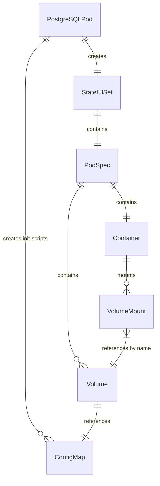
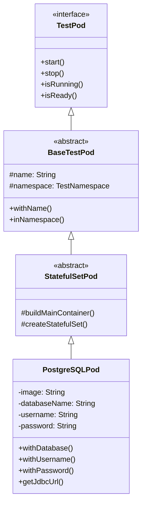

# Spec 02: PostgreSQL Pod Implementation

**Version:** 1.0
**Priority:** P0 (MVP Phase 1)
**Status:** Ready for Implementation
**PRD References:** FR-5 (Pre-built Modules), Section 13 (Module Specifications)

---

## Overview

Implement `PostgreSQLPod` as the first database module for TestPods, following Testcontainers' PostgreSQLContainer API patterns but adapted for Kubernetes deployment.

## Problem Statement

Developers need a pre-configured PostgreSQL pod that:
- Starts quickly with sensible defaults
- Exposes JDBC connection strings for test code
- Integrates with Spring Boot's `@DynamicPropertySource`
- Handles database initialization via scripts

## Proposed Solution

Create `PostgreSQLPod` extending `StatefulSetPod` (for data persistence) with:
- Fluent configuration API matching Testcontainers patterns
- Multiple wait strategy layers (pod ready + log message + JDBC connection)
- Connection information methods for both external and internal access
- Init script support via ConfigMap mounting

---

## Init Script Volume Mounting Pattern

> **Reference:** This pattern was established by refactoring [04-fix-init-script-configmap-mount](refactorings/04-fix-init-script-configmap-mount.md) to fix a bug where init scripts were not being mounted correctly.

### Problem Background

PostgreSQL Docker images automatically execute scripts placed in `/docker-entrypoint-initdb.d/` during first-time database initialization. To make init scripts available, TestPods must:

1. Store the SQL content in a Kubernetes ConfigMap
2. Mount the ConfigMap as a Volume in the pod spec
3. Add a VolumeMount in the container pointing to the init script directory

### Implementation Requirements

When implementing init script support, **all three components must be present**:

#### 1. ConfigMap Creation (Lifecycle Method)

Create the ConfigMap **before** the StatefulSet to ensure it exists when referenced:

```java
// Constants for consistency
static final String INIT_SCRIPTS_VOLUME_NAME = "init-scripts";
static final String INIT_SCRIPTS_MOUNT_PATH = "/docker-entrypoint-initdb.d";

@Override
public void start() {
    ensureNamespace();
    if (!namespace.isCreated()) {
        namespace.create();
    }

    // ConfigMap MUST be created before StatefulSet
    if (hasInitScripts()) {
        createInitScriptConfigMap();
    }

    super.start();  // Creates StatefulSet that references ConfigMap
}

private void createInitScriptConfigMap() {
    ConfigMap configMap = new ConfigMapBuilder()
        .withNewMetadata()
            .withName(name + "-init")  // Name pattern: {podName}-init
            .withNamespace(namespace.getName())
        .endMetadata()
        .addToData("init.sql", sqlContent)
        .build();
    client.configMaps().inNamespace(namespace.getName())
        .resource(configMap).create();
}
```

#### 2. Volume in Pod Spec (applyPodCustomizations)

Add a Volume that references the ConfigMap by name:

```java
@Override
protected PodSpecBuilder applyPodCustomizations(PodSpecBuilder baseSpec) {
    baseSpec = super.applyPodCustomizations(baseSpec);

    if (hasInitScripts()) {
        baseSpec.addToVolumes(new VolumeBuilder()
            .withName(INIT_SCRIPTS_VOLUME_NAME)  // Must match VolumeMount name
            .withNewConfigMap()
                .withName(name + "-init")        // Must match ConfigMap name
            .endConfigMap()
            .build());
    }

    return baseSpec;
}
```

#### 3. VolumeMount in Container (buildMainContainer)

Add a VolumeMount that links to the Volume and specifies the mount path:

```java
@Override
protected Container buildMainContainer() {
    ContainerBuilder builder = new ContainerBuilder()
        .withName("postgres")
        .withImage(image)
        // ... other configuration ...

    if (hasInitScripts()) {
        builder.addNewVolumeMount()
            .withName(INIT_SCRIPTS_VOLUME_NAME)  // Must match Volume name
            .withMountPath(INIT_SCRIPTS_MOUNT_PATH)
            .withReadOnly(true)                   // Security: read-only
        .endVolumeMount();
    }

    return builder.build();
}
```

### Kubernetes Volume Linking

The Volume and VolumeMount are linked by **name** in Kubernetes:



### Critical Ordering

1. **Namespace** must exist before ConfigMap creation
2. **ConfigMap** must exist before StatefulSet creation
3. **Volume** references ConfigMap by name in pod spec
4. **VolumeMount** references Volume by name in container spec
5. **Cleanup**: Delete StatefulSet first, then ConfigMap

### Common Mistakes to Avoid

| Mistake | Result | Fix |
|---------|--------|-----|
| Creating ConfigMap after StatefulSet | Pod fails to mount non-existent ConfigMap | Override `start()` to create ConfigMap first |
| Volume and VolumeMount names don't match | Volume not mounted to container | Use shared constant for volume name |
| ConfigMap name doesn't match Volume reference | Pod fails to find ConfigMap | Use consistent naming pattern (`{podName}-init`) |
| Missing Volume in pod spec | VolumeMount has nothing to mount | Override `applyPodCustomizations()` |
| Missing VolumeMount in container | Files not visible in container | Add VolumeMount in `buildMainContainer()` |

---

## Technical Approach

### Class Hierarchy

```
TestPod<SELF> (interface)
    └── BaseTestPod<SELF> (abstract)
        └── StatefulSetPod<SELF>
            └── PostgreSQLPod
```

### Implementation

**File:** `core/src/main/java/org/testpods/core/pods/external/postgresql/PostgreSQLPod.java`

```java
package org.testpods.core.pods.external.postgresql;

import io.fabric8.kubernetes.api.model.*;
import io.fabric8.kubernetes.api.model.apps.StatefulSet;
import io.fabric8.kubernetes.api.model.apps.StatefulSetBuilder;
import io.fabric8.kubernetes.client.KubernetesClient;
import org.testpods.core.PropertyContext;
import org.testpods.core.pods.StatefulSetPod;
import org.testpods.core.wait.WaitStrategy;

import java.time.Duration;
import java.util.*;

/**
 * A PostgreSQL database pod for integration testing.
 *
 * <p>Provides a fully configured PostgreSQL instance running in Kubernetes
 * with automatic lifecycle management through the TestPods JUnit extension.
 *
 * <h2>Basic Usage</h2>
 * <pre>{@code
 * @TestPods
 * class MyDatabaseTest {
 *
 *     @Pod
 *     static PostgreSQLPod postgres = new PostgreSQLPod()
 *         .withDatabase("myapp")
 *         .withUsername("testuser")
 *         .withPassword("testpass");
 *
 *     @DynamicPropertySource
 *     static void configureProperties(DynamicPropertyRegistry registry) {
 *         registry.add("spring.datasource.url", postgres::getJdbcUrl);
 *         registry.add("spring.datasource.username", postgres::getUsername);
 *         registry.add("spring.datasource.password", postgres::getPassword);
 *     }
 *
 *     @Test
 *     void shouldConnectToDatabase() {
 *         try (Connection conn = DriverManager.getConnection(
 *                 postgres.getJdbcUrl(),
 *                 postgres.getUsername(),
 *                 postgres.getPassword())) {
 *             // Test database operations
 *         }
 *     }
 * }
 * }</pre>
 *
 * <h2>With Initialization Script</h2>
 * <pre>{@code
 * @Pod
 * static PostgreSQLPod postgres = new PostgreSQLPod()
 *     .withDatabase("orders")
 *     .withInitScript("db/init.sql");  // Loaded from classpath
 * }</pre>
 *
 * @see StatefulSetPod
 */
public class PostgreSQLPod extends StatefulSetPod<PostgreSQLPod> {

    // === Constants ===

    public static final String DEFAULT_IMAGE = "postgres:16-alpine";
    public static final int POSTGRESQL_PORT = 5432;
    public static final String DEFAULT_DATABASE = "test";
    public static final String DEFAULT_USERNAME = "test";
    public static final String DEFAULT_PASSWORD = "test";

    // === Configuration ===

    private String image = DEFAULT_IMAGE;
    private String databaseName = DEFAULT_DATABASE;
    private String username = DEFAULT_USERNAME;
    private String password = DEFAULT_PASSWORD;
    private final Map<String, String> urlParameters = new LinkedHashMap<>();
    private String initScriptPath;
    private String initScriptContent;

    // === Constructors ===

    /**
     * Create a PostgreSQL pod with the default image (postgres:16-alpine).
     */
    public PostgreSQLPod() {
        this(DEFAULT_IMAGE);
    }

    /**
     * Create a PostgreSQL pod with a specific image.
     *
     * @param image PostgreSQL image (e.g., "postgres:15-alpine", "postgres:14")
     */
    public PostgreSQLPod(String image) {
        this.image = image;
        this.name = "postgres";
    }

    // === Configuration Fluent API ===

    /**
     * Set the PostgreSQL image version.
     *
     * @param version version tag (e.g., "15", "16-alpine")
     * @return this pod for chaining
     */
    public PostgreSQLPod withVersion(String version) {
        this.image = "postgres:" + version;
        return this;
    }

    /**
     * Set the database name.
     *
     * @param databaseName name of the database to create
     * @return this pod for chaining
     */
    public PostgreSQLPod withDatabase(String databaseName) {
        this.databaseName = databaseName;
        return this;
    }

    /**
     * Set the database username.
     *
     * @param username PostgreSQL username
     * @return this pod for chaining
     */
    public PostgreSQLPod withUsername(String username) {
        this.username = username;
        return this;
    }

    /**
     * Set the database password.
     *
     * @param password PostgreSQL password
     * @return this pod for chaining
     */
    public PostgreSQLPod withPassword(String password) {
        this.password = password;
        return this;
    }

    /**
     * Add a JDBC URL parameter.
     *
     * @param key   parameter name
     * @param value parameter value
     * @return this pod for chaining
     */
    public PostgreSQLPod withUrlParam(String key, String value) {
        this.urlParameters.put(key, value);
        return this;
    }

    /**
     * Set an initialization SQL script from the classpath.
     *
     * <p>The script will be executed once when the database starts.
     *
     * @param classpathResource path to SQL file on classpath (e.g., "db/init.sql")
     * @return this pod for chaining
     */
    public PostgreSQLPod withInitScript(String classpathResource) {
        this.initScriptPath = classpathResource;
        return this;
    }

    /**
     * Set initialization SQL content directly.
     *
     * @param sql SQL statements to execute on startup
     * @return this pod for chaining
     */
    public PostgreSQLPod withInitSql(String sql) {
        this.initScriptContent = sql;
        return this;
    }

    // === Connection Information ===

    /**
     * Get the JDBC connection URL for external access (from test code).
     *
     * @return JDBC URL like "jdbc:postgresql://host:port/database"
     */
    public String getJdbcUrl() {
        return "jdbc:postgresql://" + getExternalHost() + ":" + getExternalPort()
            + "/" + databaseName + constructUrlParameters();
    }

    /**
     * Get the internal JDBC URL for pod-to-pod communication.
     *
     * @return JDBC URL using Kubernetes service DNS
     */
    public String getInternalJdbcUrl() {
        return "jdbc:postgresql://" + getInternalHost() + ":" + POSTGRESQL_PORT
            + "/" + databaseName + constructUrlParameters();
    }

    /**
     * Get the R2DBC connection URL for reactive access.
     *
     * @return R2DBC URL like "r2dbc:postgresql://host:port/database"
     */
    public String getR2dbcUrl() {
        return "r2dbc:postgresql://" + getExternalHost() + ":" + getExternalPort()
            + "/" + databaseName;
    }

    /**
     * Get the database name.
     */
    public String getDatabaseName() {
        return databaseName;
    }

    /**
     * Get the database username.
     */
    public String getUsername() {
        return username;
    }

    /**
     * Get the database password.
     */
    public String getPassword() {
        return password;
    }

    /**
     * Get the JDBC driver class name.
     */
    public String getDriverClassName() {
        return "org.postgresql.Driver";
    }

    @Override
    public int getInternalPort() {
        return POSTGRESQL_PORT;
    }

    private String constructUrlParameters() {
        if (urlParameters.isEmpty()) {
            return "";
        }
        StringJoiner joiner = new StringJoiner("&", "?", "");
        urlParameters.forEach((k, v) -> joiner.add(k + "=" + v));
        return joiner.toString();
    }

    // === Property Publishing ===

    @Override
    public void publishProperties(PropertyContext ctx) {
        String prefix = getName();

        // External (for test code)
        ctx.publish(prefix + ".host", this::getExternalHost);
        ctx.publish(prefix + ".port", () -> String.valueOf(getExternalPort()));
        ctx.publish(prefix + ".uri", this::getJdbcUrl);
        ctx.publish(prefix + ".jdbcUrl", this::getJdbcUrl);
        ctx.publish(prefix + ".r2dbcUrl", this::getR2dbcUrl);
        ctx.publish(prefix + ".username", this::getUsername);
        ctx.publish(prefix + ".password", this::getPassword);
        ctx.publish(prefix + ".database", this::getDatabaseName);

        // Internal (for other pods in cluster)
        ctx.publish(prefix + ".internal.host", this::getInternalHost);
        ctx.publish(prefix + ".internal.port", () -> String.valueOf(POSTGRESQL_PORT));
        ctx.publish(prefix + ".internal.uri", this::getInternalJdbcUrl);
    }

    // === Wait Strategy ===

    @Override
    protected WaitStrategy getDefaultWaitStrategy() {
        return new PostgreSQLWaitStrategy()
            .withTimeout(Duration.ofMinutes(2));
    }

    // === Init Script Volume Mounting ===
    // See "Init Script Volume Mounting Pattern" section above for details

    /** Volume name for init scripts ConfigMap mount. */
    static final String INIT_SCRIPTS_VOLUME_NAME = "init-scripts";

    /** Mount path for PostgreSQL Docker image init scripts. */
    static final String INIT_SCRIPTS_MOUNT_PATH = "/docker-entrypoint-initdb.d";

    /**
     * Check if init scripts are configured.
     */
    boolean hasInitScripts() {
        return initScriptPath != null || initScriptContent != null;
    }

    @Override
    protected Container buildMainContainer() {
        ContainerBuilder builder = new ContainerBuilder()
            .withName("postgres")
            .withImage(image)
            .addNewPort().withContainerPort(5432).endPort()
            // ... environment variables and probes ...

        // Add init scripts volume mount if configured (Step 1 of fix)
        if (hasInitScripts()) {
            builder.addNewVolumeMount()
                .withName(INIT_SCRIPTS_VOLUME_NAME)
                .withMountPath(INIT_SCRIPTS_MOUNT_PATH)
                .withReadOnly(true)
            .endVolumeMount();
        }

        return builder.build();
    }

    @Override
    protected PodSpecBuilder applyPodCustomizations(PodSpecBuilder baseSpec) {
        baseSpec = super.applyPodCustomizations(baseSpec);

        // Add init scripts volume if configured (Step 2 of fix)
        if (hasInitScripts()) {
            baseSpec.addToVolumes(new VolumeBuilder()
                .withName(INIT_SCRIPTS_VOLUME_NAME)
                .withNewConfigMap()
                    .withName(name + "-init")
                .endConfigMap()
                .build());
        }

        return baseSpec;
    }

    // === Lifecycle - ConfigMap must be created before StatefulSet ===

    @Override
    public void start() {
        ensureNamespace();
        if (!namespace.isCreated()) {
            namespace.create();
        }

        // Create init script ConfigMap BEFORE super.start() creates StatefulSet (Step 3 of fix)
        if (hasInitScripts()) {
            createInitScriptConfigMap();
        }

        super.start();  // Creates StatefulSet that references the ConfigMap
    }

    @Override
    public void stop() {
        super.stop();  // Delete StatefulSet first

        // Clean up the ConfigMap after stopping the StatefulSet
        if (hasInitScripts()) {
            deleteInitScriptConfigMap();
        }
    }

    private void createInitScriptConfigMap() {
        String sql = initScriptContent;
        if (sql == null && initScriptPath != null) {
            sql = loadClasspathResource(initScriptPath);
        }

        if (sql == null) return;

        KubernetesClient client = getClient();
        ConfigMap configMap = new ConfigMapBuilder()
            .withNewMetadata()
                .withName(name + "-init")
                .withNamespace(namespace.getName())
                .addToLabels("app", name)
                .addToLabels("managed-by", "testpods")
            .endMetadata()
            .addToData("init.sql", sql)
            .build();

        client.configMaps()
            .inNamespace(namespace.getName())
            .resource(configMap)
            .create();
    }

    private void deleteInitScriptConfigMap() {
        KubernetesClient client = getClient();
        client.configMaps()
            .inNamespace(namespace.getName())
            .withName(name + "-init")
            .delete();
    }

    private String loadClasspathResource(String path) {
        try (var is = getClass().getClassLoader().getResourceAsStream(path)) {
            if (is == null) {
                throw new IllegalArgumentException("Resource not found: " + path);
            }
            return new String(is.readAllBytes());
        } catch (Exception e) {
            throw new RuntimeException("Failed to load init script: " + path, e);
        }
    }
}
```

**File:** `core/src/main/java/org/testpods/core/pods/external/postgresql/PostgreSQLWaitStrategy.java`

```java
package org.testpods.core.pods.external.postgresql;

import org.testpods.core.pods.TestPod;
import org.testpods.core.wait.WaitStrategy;

import java.sql.Connection;
import java.sql.DriverManager;
import java.sql.SQLException;
import java.time.Duration;

/**
 * Wait strategy for PostgreSQL pods.
 *
 * <p>Performs a multi-layer readiness check:
 * <ol>
 *   <li>Wait for Kubernetes pod to be Ready</li>
 *   <li>Wait for "database system is ready to accept connections" log message (x2)</li>
 *   <li>Verify JDBC connection with SELECT 1</li>
 * </ol>
 */
public class PostgreSQLWaitStrategy implements WaitStrategy {

    private Duration timeout = Duration.ofMinutes(1);
    private Duration pollInterval = Duration.ofMillis(500);

    public PostgreSQLWaitStrategy withTimeout(Duration timeout) {
        this.timeout = timeout;
        return this;
    }

    @Override
    public void waitUntilReady(TestPod<?> testPod) {
        if (!(testPod instanceof PostgreSQLPod)) {
            throw new IllegalArgumentException("PostgreSQLWaitStrategy requires PostgreSQLPod");
        }

        PostgreSQLPod postgres = (PostgreSQLPod) testPod;
        long deadline = System.currentTimeMillis() + timeout.toMillis();

        // Step 1: Wait for pod to be ready (Kubernetes readiness probe)
        waitForPodReady(postgres, deadline);

        // Step 2: Wait for log message (PostgreSQL logs this twice)
        waitForLogMessage(postgres, "database system is ready to accept connections", 2, deadline);

        // Step 3: Verify JDBC connection
        waitForJdbcConnection(postgres, deadline);
    }

    private void waitForPodReady(PostgreSQLPod postgres, long deadline) {
        while (System.currentTimeMillis() < deadline) {
            if (postgres.isReady()) {
                return;
            }
            sleep(pollInterval);
        }
        throw new IllegalStateException("Timed out waiting for PostgreSQL pod to be ready");
    }

    private void waitForLogMessage(PostgreSQLPod postgres, String message, int times, long deadline) {
        while (System.currentTimeMillis() < deadline) {
            String logs = postgres.getLogs();
            long count = logs.lines()
                .filter(line -> line.contains(message))
                .count();
            if (count >= times) {
                return;
            }
            sleep(pollInterval);
        }
        throw new IllegalStateException(
            "Timed out waiting for PostgreSQL log message: " + message);
    }

    private void waitForJdbcConnection(PostgreSQLPod postgres, long deadline) {
        String url = postgres.getJdbcUrl();
        String user = postgres.getUsername();
        String pass = postgres.getPassword();

        while (System.currentTimeMillis() < deadline) {
            try (Connection conn = DriverManager.getConnection(url, user, pass)) {
                conn.createStatement().execute("SELECT 1");
                return; // Success!
            } catch (SQLException e) {
                // Connection failed, retry
                sleep(pollInterval);
            }
        }
        throw new IllegalStateException(
            "Timed out waiting for PostgreSQL JDBC connection at: " + url);
    }

    private void sleep(Duration duration) {
        try {
            Thread.sleep(duration.toMillis());
        } catch (InterruptedException e) {
            Thread.currentThread().interrupt();
            throw new IllegalStateException("Interrupted while waiting", e);
        }
    }
}
```

---

## Acceptance Criteria

### Functional Requirements

- [ ] `PostgreSQLPod` starts a PostgreSQL instance in Kubernetes
- [ ] Default configuration: postgres:16-alpine, database=test, user=test, password=test
- [ ] `withDatabase()`, `withUsername()`, `withPassword()` configure the instance
- [ ] `getJdbcUrl()` returns a valid JDBC connection string
- [ ] `getInternalJdbcUrl()` returns URL for pod-to-pod communication
- [ ] `withInitScript()` executes SQL on startup
- [ ] Wait strategy verifies JDBC connectivity before declaring ready

### Quality Gates

- [ ] Integration test with actual database operations
- [ ] JavaDoc on all public methods with usage examples
- [ ] Test coverage > 80%

---

## Test Plan

### Integration Tests

`core/src/test/java/org/testpods/core/pods/external/postgresql/PostgreSQLPodTest.java`:

```java
@TestPods
class PostgreSQLPodTest {

    @Pod
    static PostgreSQLPod postgres = new PostgreSQLPod()
        .withDatabase("testdb")
        .withUsername("testuser")
        .withPassword("testpass");

    @Test
    void shouldBeRunning() {
        assertThat(postgres.isRunning()).isTrue();
        assertThat(postgres.isReady()).isTrue();
    }

    @Test
    void shouldProvideValidJdbcUrl() {
        String url = postgres.getJdbcUrl();

        assertThat(url).startsWith("jdbc:postgresql://");
        assertThat(url).contains("/testdb");
    }

    @Test
    void shouldConnectViaJdbc() throws SQLException {
        try (Connection conn = DriverManager.getConnection(
                postgres.getJdbcUrl(),
                postgres.getUsername(),
                postgres.getPassword())) {

            try (var stmt = conn.createStatement()) {
                var rs = stmt.executeQuery("SELECT 1 AS value");
                rs.next();
                assertThat(rs.getInt("value")).isEqualTo(1);
            }
        }
    }

    @Test
    void shouldExecuteInitScript() throws SQLException {
        PostgreSQLPod withInit = new PostgreSQLPod()
            .withDatabase("initdb")
            .withInitSql("CREATE TABLE IF NOT EXISTS users (id SERIAL PRIMARY KEY, name TEXT);");

        withInit.inNamespace(postgres.getNamespace()).start();

        try (Connection conn = DriverManager.getConnection(
                withInit.getJdbcUrl(),
                withInit.getUsername(),
                withInit.getPassword())) {

            try (var stmt = conn.createStatement()) {
                stmt.execute("INSERT INTO users (name) VALUES ('Alice')");
                var rs = stmt.executeQuery("SELECT COUNT(*) FROM users");
                rs.next();
                assertThat(rs.getInt(1)).isEqualTo(1);
            }
        } finally {
            withInit.stop();
        }
    }
}
```

### Spring Boot Integration Test

```java
@TestPods
@SpringBootTest
class SpringPostgresIntegrationTest {

    @Pod
    static PostgreSQLPod postgres = new PostgreSQLPod()
        .withDatabase("orders");

    @DynamicPropertySource
    static void configureProperties(DynamicPropertyRegistry registry) {
        registry.add("spring.datasource.url", postgres::getJdbcUrl);
        registry.add("spring.datasource.username", postgres::getUsername);
        registry.add("spring.datasource.password", postgres::getPassword);
        registry.add("spring.datasource.driver-class-name", postgres::getDriverClassName);
    }

    @Autowired
    JdbcTemplate jdbcTemplate;

    @Test
    void shouldUsePostgresDataSource() {
        Integer result = jdbcTemplate.queryForObject("SELECT 1", Integer.class);
        assertThat(result).isEqualTo(1);
    }
}
```

---

## Dependencies

Add to `core/pom.xml`:

```xml
<!-- Optional: PostgreSQL JDBC driver for connection verification -->
<dependency>
    <groupId>org.postgresql</groupId>
    <artifactId>postgresql</artifactId>
    <version>42.7.3</version>
    <scope>compile</scope>
    <optional>true</optional>
</dependency>
```

---

## ERD



---

## References

- Testcontainers PostgreSQLContainer: https://github.com/testcontainers/testcontainers-java
- PostgreSQL Docker image: https://hub.docker.com/_/postgres
- PRD FR-5: Pre-built Modules
- PRD Section 21.11.1: MVP Priority (PostgreSQL)
