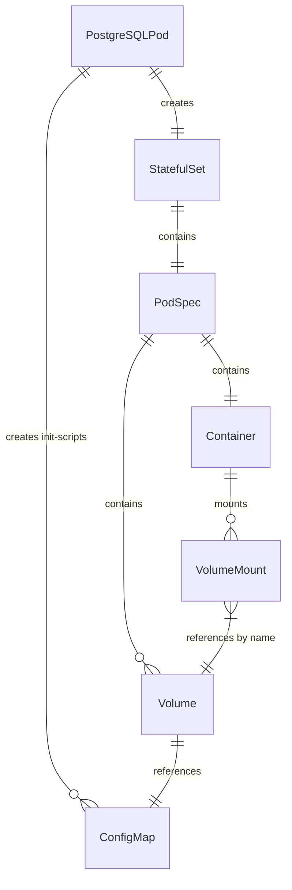

# Fix Init Script ConfigMap Mount Bug

> **Status:** ⏸️ DEFERRED
>
> **Note:** This plan is deferred because PostgreSQLPod does not yet exist in the codebase.
> This plan documents a design pattern that MUST be followed when implementing PostgreSQLPod
> to ensure init scripts are properly mounted. When PostgreSQLPod is implemented, incorporate
> these patterns directly into the implementation.

## Executive Summary

### Problem Statement

In the PostgreSQL pod implementation, `createInitScriptConfigMap()` creates a ConfigMap containing init scripts, but `buildMainContainer()` never mounts this ConfigMap as a volume.

**Result:** PostgreSQL init scripts will never execute because the files don't appear in `/docker-entrypoint-initdb.d/`.

**Root Cause:** The implementation creates the ConfigMap resource but fails to:
1. Add a Volume referencing the ConfigMap to the pod spec
2. Add a VolumeMount to the container pointing to `/docker-entrypoint-initdb.d/`

**Impact:** Critical - Init scripts silently fail to execute, making database initialization non-functional.

### Solution Statement

Fix the bug by properly connecting the ConfigMap to the container through Kubernetes volume mechanics:

1. **Add VolumeMount to container:** Mount the ConfigMap at `/docker-entrypoint-initdb.d/` where PostgreSQL Docker images expect init scripts
2. **Add Volume to pod spec:** Reference the ConfigMap as a volume source in the pod specification
3. **Conditional logic:** Only add volume/mount when `initScripts` is non-empty

### Solution Properties

- **Volume Name Consistency:** Use `"init-scripts"` consistently for both Volume and VolumeMount
- **ConfigMap Name Pattern:** Must match the name used in `createInitScriptConfigMap()`: `name + "-init"`
- **Mount Path:** PostgreSQL Docker images expect init scripts at `/docker-entrypoint-initdb.d/`
- **Read-Only Mount:** Init scripts should be mounted read-only for security
- **Ordering:** ConfigMap must be created BEFORE StatefulSet, and Volume must be added to pod spec before container references it
- **Minimal Change:** No changes to existing ConfigMap creation logic

---

## Background Research

### PostgreSQL Docker Image Init Script Behavior

PostgreSQL official Docker images automatically execute scripts placed in `/docker-entrypoint-initdb.d/` during first-time database initialization. Supported formats:
- `.sql` files - executed directly
- `.sh` files - sourced by bash
- `.sql.gz` files - decompressed and executed

### Kubernetes Volume Mechanics

To expose ConfigMap data to a container:
1. Define a Volume in pod spec that references the ConfigMap by name
2. Add a VolumeMount in the container that references the Volume by name and specifies mount path
3. Both Volume and VolumeMount must use the same name to link them

### Existing Code Patterns

The codebase already has patterns for:
- ConfigMap creation in `createInitScriptConfigMap()` method
- Volume handling in `StatefulSetPod` base class via `applyPodCustomizations()`
- Container building via `buildMainContainer()` method

### Related Files

- `specs/02-postgresql-pod-implementation.md` - Spec to update with fix
- `core/src/main/java/org/testpods/core/pods/PostgreSQLPod.java` (future) - Implementation file

### References

- PostgreSQL Docker image docs: https://hub.docker.com/_/postgres (init scripts section)
- Fabric8 VolumeMount docs: https://github.com/fabric8io/kubernetes-client/blob/main/doc/CHEATSHEET.md

---

## Implementation Steps

### Status: ✅ | Step 1: Add VolumeMount to buildMainContainer()

#### Step 1 Purpose

Enable the PostgreSQL container to access init script files by mounting the ConfigMap volume at the path where PostgreSQL expects initialization scripts.

#### Step 1 Description

Modify the `buildMainContainer()` method in `PostgreSQLPod` to conditionally add a VolumeMount when init scripts are present.

**File to modify:** `core/src/main/java/org/testpods/core/pods/PostgreSQLPod.java`

**Change required in `buildMainContainer` method:**

Pseudo-code (builders must write actual implementation):
```
method buildMainContainer():
    builder = new ContainerBuilder()
        .withName("postgres")
        .withImage(image)
        .addPort(5432)
        .withEnv(buildEnvVars())

    if initScripts is not empty:
        builder.addVolumeMount(
            name: "init-scripts"
            mountPath: "/docker-entrypoint-initdb.d"
            readOnly: true
        )

    return builder.build()
```

**Acceptance Criteria:**
- [ ] VolumeMount points to `/docker-entrypoint-initdb.d`
- [ ] VolumeMount is read-only
- [ ] No VolumeMount added when `initScripts` is empty

---

### Status: ✅ | Step 2: Add Volume to Pod Spec

#### Step 2 Purpose

Define the ConfigMap as a volume source in the pod specification so the container can mount it.

#### Step 2 Description

Override `applyPodCustomizations()` in `PostgreSQLPod` to add the ConfigMap volume when init scripts are present.

**File to modify:** `core/src/main/java/org/testpods/core/pods/PostgreSQLPod.java`

**Change required - override `applyPodCustomizations` method:**

Pseudo-code (builders must write actual implementation):
```
method applyPodCustomizations(baseSpec):
    baseSpec = super.applyPodCustomizations(baseSpec)

    if initScripts is not empty:
        baseSpec.addVolume(
            name: "init-scripts"
            configMap:
                name: this.name + "-init"
        )

    return baseSpec
```

**Acceptance Criteria:**
- [ ] Volume name matches VolumeMount name ("init-scripts")
- [ ] ConfigMap reference matches name from `createInitScriptConfigMap()` (name + "-init")
- [ ] No volume added when `initScripts` is empty

---

### Status: ✅ | Step 3: Verify ConfigMap Creation Order

#### Step 3 Purpose

Ensure the ConfigMap is created before the StatefulSet that references it, preventing mount failures.

#### Step 3 Description

Verify that the `start()` method creates the init script ConfigMap BEFORE calling `super.start()` which creates the StatefulSet.

**File to verify:** `core/src/main/java/org/testpods/core/pods/PostgreSQLPod.java`

**Expected order in `start` method:**

Pseudo-code (builders must write actual implementation):
```
method start():
    ensureNamespace()

    if initScripts is not empty:
        createInitScriptConfigMap()  // Must happen BEFORE super.start()

    super.start()  // Creates StatefulSet that references the ConfigMap
```

**Acceptance Criteria:**
- [ ] ConfigMap created before StatefulSet
- [ ] No errors on pod startup due to missing ConfigMap

---

### Status: ✅ | Step 4: Write Integration Tests

#### Step 4 Purpose

Verify the fix works end-to-end by testing that init scripts actually execute and create expected database objects.

#### Step 4 Description

Create comprehensive tests in `PostgreSQLPodInitScriptTest.java` to verify:
1. Init scripts execute on PostgreSQL startup
2. Volume mount is correctly configured in pod spec
3. No volume/mount when init scripts are absent

**File to create:** `core/src/test/java/org/testpods/core/pods/PostgreSQLPodInitScriptTest.java`

**Test cases (pseudo-code - builders must write actual implementation):**

```
test shouldExecuteInitScripts:
    postgres = new PostgreSQLPod()
        .withName("test-init")
        .withInitScript("01-create-schema.sql", "CREATE TABLE test_table (id INT);")

    postgres.start()

    connection = postgres.getConnection()
    // Verify table was created by init script
    tables = connection.getMetaData().getTables(null, null, "test_table", null)
    assert tables.next() is true

    postgres.stop()

test shouldMountInitScriptsVolume:
    postgres = new PostgreSQLPod()
        .withName("test-mount")
        .withInitScript("test.sql", "SELECT 1;")

    podSpec = postgres.buildPodSpec()

    // Verify volume exists
    assert podSpec.volumes contains volume with name "init-scripts"

    // Verify volume mount in container
    mainContainer = podSpec.containers[0]
    assert mainContainer.volumeMounts contains mount with:
        name: "init-scripts"
        mountPath: "/docker-entrypoint-initdb.d"

test shouldNotMountVolumeWithoutInitScripts:
    postgres = new PostgreSQLPod()
        .withName("test-no-init")

    podSpec = postgres.buildPodSpec()

    assert podSpec.volumes does not contain volume with name "init-scripts"
```

**Acceptance Criteria:**
- [ ] Integration test verifies init script creates expected database objects
- [ ] Test confirms volume mount path is correct
- [ ] Test confirms ConfigMap name matches
- [ ] Test confirms no volume when no init scripts

---

### Status: ✅ | Step 5: Update Specification Document

#### Step 5 Purpose

Document the correct implementation pattern in the specification so future implementations follow it.

#### Step 5 Description

Update the PostgreSQL pod specification to include the volume mounting pattern.

**File to modify:** `specs/02-postgresql-pod-implementation.md`

**Changes required:**
- Add section documenting init script volume mounting
- Include code examples showing correct VolumeMount and Volume setup
- Reference this bug fix plan for context

**Acceptance Criteria:**
- [ ] Spec documents the volume mounting pattern
- [ ] Code examples in spec are correct
- [ ] Future implementers can follow spec without hitting this bug

---

## Entity Relationship Diagram



---

## Validation Output

After implementation, write results to `specs/refactorings/04-fix-init-script-configmap-mount_result.md`
