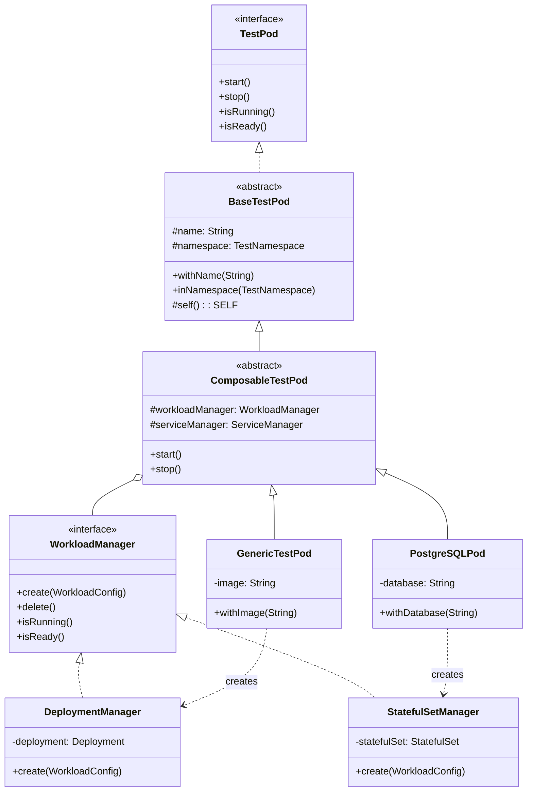

# Plan: Extract WorkloadManager Component

**Priority:** High
**Effort:** Large
**Category:** Architecture / Composition Over Inheritance
**Phase:** 2 - Architecture Refactoring (Can be done in parallel with 02, 03)

---

## Overview

Extract workload management (Deployment/StatefulSet creation, deletion, readiness) from the pod class hierarchy into a composable `WorkloadManager` component, reducing code duplication and enabling mix-and-match workload types.

## Problem Statement

The current hierarchy has significant code duplication between `DeploymentPod` and `StatefulSetPod`:

```
TestPod (interface)
    └── BaseTestPod (abstract - common state)
            ├── DeploymentPod (abstract - Deployment-specific)
            │       └── GenericTestPod, etc.
            └── StatefulSetPod (abstract - StatefulSet-specific)
                    └── PostgreSQLPod, MongoDBPod, etc.
```

Both classes have:
- Nearly identical `start()` methods (~70% shared structure)
- Nearly identical `stop()` methods
- Nearly identical `isRunning()` / `isReady()` patterns
- Duplicated customizer lists (`serviceCustomizers`, etc.)

### Consequences
- Bug fixes must be applied twice
- New features get inconsistent implementations
- Adding new workload types (Job, DaemonSet) requires more duplication

## Proposed Solution

### Target Architecture

```
TestPod (interface)
    └── BaseTestPod (abstract - common state, fluent API)
            └── ComposableTestPod (abstract - workload composition)
                    ├── PostgreSQLPod (composes StatefulSetManager)
                    ├── GenericTestPod (composes DeploymentManager)
                    └── Future: BatchJobPod (composes JobManager)
```

### WorkloadManager Interface

```java
package org.testpods.core.workload;

import io.fabric8.kubernetes.client.KubernetesClient;

/**
 * Manages the Kubernetes workload resource (Deployment, StatefulSet, Job, etc.).
 * This is an internal implementation detail, not exposed to pod users.
 */
public interface WorkloadManager {

    /**
     * Create the workload in the cluster.
     * @param config Workload configuration from the pod
     */
    void create(WorkloadConfig config);

    /**
     * Delete the workload from the cluster.
     */
    void delete();

    /**
     * Check if the workload exists and has running replicas.
     */
    boolean isRunning();

    /**
     * Check if the workload has all desired replicas ready.
     */
    boolean isReady();

    /**
     * Get the workload name for label selectors.
     */
    String getName();

    /**
     * Get the workload type for logging/debugging.
     */
    default String getWorkloadType() {
        return getClass().getSimpleName().replace("Manager", "");
    }
}
```

### WorkloadConfig Record

```java
package org.testpods.core.workload;

import io.fabric8.kubernetes.api.model.Container;
import io.fabric8.kubernetes.api.model.PodSpecBuilder;
import io.fabric8.kubernetes.client.KubernetesClient;
import java.util.Map;

/**
 * Configuration passed from pod to workload manager.
 */
public record WorkloadConfig(
    String name,
    String namespace,
    Map<String, String> labels,
    Map<String, String> annotations,
    Container mainContainer,
    PodSpecBuilder podSpec,
    KubernetesClient client
) {
    public static Builder builder() {
        return new Builder();
    }

    public static class Builder {
        // Fluent builder implementation
    }
}
```

## Technical Considerations

### Design Constraints (MUST Preserve)

1. **BaseTestPod remains** - It provides essential cross-cutting concerns:
   - State management (name, namespace, labels, annotations)
   - Fluent API foundation (`self()` pattern)
   - Mid-level customization (init containers, sidecars)
   - Common operations (`getLogs()`, `exec()`, `waitForReady()`)

2. **Fluent interface coherence** - The developer API must remain clean:
   ```java
   PostgreSQLPod postgres = new PostgreSQLPod()
       .withName("db")
       .withDatabase("myapp")
       .withPersistentVolume("1Gi")
       .withInitContainer(init -> init.withImage("busybox"));
   ```

3. **Internal composition** - WorkloadManager is an implementation detail, NOT exposed to pod users.

### Java 17+ Features to Use

- **Records** for WorkloadConfig (immutable, auto-generated equals/hashCode)
- **Sealed interfaces** for exhaustive pattern matching (optional enhancement)
- **Pattern matching** in switch expressions for workload type handling

## Acceptance Criteria

### Functional Requirements
- [ ] `WorkloadManager` interface exists with `create()`, `delete()`, `isRunning()`, `isReady()` methods
- [ ] `StatefulSetManager` creates StatefulSets correctly
- [ ] `DeploymentManager` creates Deployments correctly
- [ ] `ComposableTestPod` extends `BaseTestPod` and composes managers
- [ ] Existing fluent API still works unchanged

### Non-Functional Requirements
- [ ] Code duplication between workload types is eliminated (DRY)
- [ ] Adding a new workload type requires only the manager, not a new base class
- [ ] Thread safety maintained

### Quality Gates
- [ ] All existing tests pass without modification
- [ ] Test coverage for each manager type
- [ ] Architecture matches target design

## Implementation Steps

### Step 1: Create Interfaces and Records
- [ ] `WorkloadManager` interface
- [ ] `WorkloadConfig` record
- [ ] `ServiceConfig` record (for ServiceManager - see task 02)

### Step 2: Create Manager Implementations
- [ ] `StatefulSetManager` - extract code from `StatefulSetPod`
- [ ] `DeploymentManager` - extract code from `DeploymentPod`

### Step 3: Create ComposableTestPod
- [ ] Extends `BaseTestPod`
- [ ] Composes WorkloadManager and ServiceManager
- [ ] Implements common `start()`, `stop()`, `isRunning()`, `isReady()`

### Step 4: Migrate Concrete Pods
- [ ] Update `GenericTestPod` to extend `ComposableTestPod`
- [ ] Update `PostgreSQLPod` to extend `ComposableTestPod`
- [ ] Update `MongoDBPod` to extend `ComposableTestPod`

### Step 5: Deprecate Old Base Classes
- [ ] Mark `DeploymentPod` and `StatefulSetPod` as `@Deprecated`
- [ ] Keep for backwards compatibility temporarily

### Step 6: Update Tests

## Files to Create/Modify

| File | Change |
|------|--------|
| `core/src/main/java/org/testpods/core/workload/WorkloadManager.java` | Create new |
| `core/src/main/java/org/testpods/core/workload/WorkloadConfig.java` | Create new |
| `core/src/main/java/org/testpods/core/workload/StatefulSetManager.java` | Create new |
| `core/src/main/java/org/testpods/core/workload/DeploymentManager.java` | Create new |
| `core/src/main/java/org/testpods/core/pods/ComposableTestPod.java` | Create new |
| `core/src/main/java/org/testpods/core/pods/GenericTestPod.java` | Modify to extend ComposableTestPod |
| `core/src/main/java/org/testpods/core/pods/DeploymentPod.java` | Deprecate |
| `core/src/main/java/org/testpods/core/pods/StatefulSetPod.java` | Deprecate |

## MVP

### WorkloadManager.java

```java
package org.testpods.core.workload;

public interface WorkloadManager {

    void create(WorkloadConfig config);
    void delete();
    boolean isRunning();
    boolean isReady();
    String getName();

    default String getWorkloadType() {
        return getClass().getSimpleName().replace("Manager", "");
    }
}
```

### DeploymentManager.java

```java
package org.testpods.core.workload;

import io.fabric8.kubernetes.api.model.apps.Deployment;
import io.fabric8.kubernetes.api.model.apps.DeploymentBuilder;
import io.fabric8.kubernetes.client.KubernetesClient;
import java.util.Map;

public class DeploymentManager implements WorkloadManager {

    private Deployment deployment;
    private WorkloadConfig config;

    @Override
    public void create(WorkloadConfig config) {
        this.config = config;

        this.deployment = new DeploymentBuilder()
            .withNewMetadata()
                .withName(config.name())
                .withNamespace(config.namespace())
                .withLabels(config.labels())
                .withAnnotations(config.annotations())
            .endMetadata()
            .withNewSpec()
                .withReplicas(1)
                .withNewSelector()
                    .withMatchLabels(Map.of("app", config.name()))
                .endSelector()
                .withNewTemplate()
                    .withNewMetadata()
                        .withLabels(config.labels())
                    .endMetadata()
                    .withSpec(config.podSpec().build())
                .endTemplate()
            .endSpec()
            .build();

        config.client().apps().deployments()
            .inNamespace(config.namespace())
            .resource(deployment)
            .create();
    }

    @Override
    public void delete() {
        if (config != null && deployment != null) {
            config.client().apps().deployments()
                .inNamespace(config.namespace())
                .withName(config.name())
                .delete();
            deployment = null;
        }
    }

    @Override
    public boolean isRunning() {
        if (config == null) return false;
        Deployment d = config.client().apps().deployments()
            .inNamespace(config.namespace())
            .withName(config.name())
            .get();
        return d != null && d.getStatus() != null
            && d.getStatus().getReadyReplicas() != null
            && d.getStatus().getReadyReplicas() > 0;
    }

    @Override
    public boolean isReady() {
        if (config == null) return false;
        Deployment d = config.client().apps().deployments()
            .inNamespace(config.namespace())
            .withName(config.name())
            .get();
        if (d == null || d.getStatus() == null) return false;
        Integer ready = d.getStatus().getReadyReplicas();
        Integer desired = d.getSpec().getReplicas();
        return ready != null && ready.equals(desired);
    }

    @Override
    public String getName() {
        return config != null ? config.name() : null;
    }
}
```

### StatefulSetManager.java

```java
package org.testpods.core.workload;

import io.fabric8.kubernetes.api.model.PersistentVolumeClaim;
import io.fabric8.kubernetes.api.model.apps.StatefulSet;
import io.fabric8.kubernetes.api.model.apps.StatefulSetBuilder;
import io.fabric8.kubernetes.client.KubernetesClient;
import java.util.List;
import java.util.Map;

public class StatefulSetManager implements WorkloadManager {

    private StatefulSet statefulSet;
    private WorkloadConfig config;

    // Optional PVC configuration
    private List<PersistentVolumeClaim> pvcTemplates = List.of();
    private String serviceName;

    public StatefulSetManager withServiceName(String serviceName) {
        this.serviceName = serviceName;
        return this;
    }

    public StatefulSetManager withPvcTemplates(List<PersistentVolumeClaim> templates) {
        this.pvcTemplates = templates;
        return this;
    }

    @Override
    public void create(WorkloadConfig config) {
        this.config = config;

        StatefulSetBuilder builder = new StatefulSetBuilder()
            .withNewMetadata()
                .withName(config.name())
                .withNamespace(config.namespace())
                .withLabels(config.labels())
            .endMetadata()
            .withNewSpec()
                .withReplicas(1)
                .withServiceName(serviceName != null ? serviceName : config.name())
                .withNewSelector()
                    .withMatchLabels(Map.of("app", config.name()))
                .endSelector()
                .withNewTemplate()
                    .withNewMetadata()
                        .withLabels(config.labels())
                    .endMetadata()
                    .withSpec(config.podSpec().build())
                .endTemplate()
            .endSpec();

        // Add PVC templates if configured
        if (!pvcTemplates.isEmpty()) {
            builder.editSpec()
                .addAllToVolumeClaimTemplates(pvcTemplates)
            .endSpec();
        }

        this.statefulSet = builder.build();

        config.client().apps().statefulSets()
            .inNamespace(config.namespace())
            .resource(statefulSet)
            .create();
    }

    @Override
    public void delete() {
        if (config != null && statefulSet != null) {
            config.client().apps().statefulSets()
                .inNamespace(config.namespace())
                .withName(config.name())
                .delete();
            statefulSet = null;
        }
    }

    @Override
    public boolean isRunning() {
        if (config == null) return false;
        StatefulSet ss = config.client().apps().statefulSets()
            .inNamespace(config.namespace())
            .withName(config.name())
            .get();
        return ss != null && ss.getStatus() != null
            && ss.getStatus().getReadyReplicas() != null
            && ss.getStatus().getReadyReplicas() > 0;
    }

    @Override
    public boolean isReady() {
        if (config == null) return false;
        StatefulSet ss = config.client().apps().statefulSets()
            .inNamespace(config.namespace())
            .withName(config.name())
            .get();
        if (ss == null || ss.getStatus() == null) return false;
        Integer ready = ss.getStatus().getReadyReplicas();
        Integer desired = ss.getSpec().getReplicas();
        return ready != null && ready.equals(desired);
    }

    @Override
    public String getName() {
        return config != null ? config.name() : null;
    }
}
```

### ComposableTestPod.java

```java
package org.testpods.core.pods;

import org.testpods.core.TestPodStartException;
import org.testpods.core.service.ServiceManager;
import org.testpods.core.workload.WorkloadConfig;
import org.testpods.core.workload.WorkloadManager;
import org.slf4j.Logger;
import org.slf4j.LoggerFactory;

/**
 * Base class for pods that compose workload and service managers.
 * Extends BaseTestPod to retain all common functionality.
 */
public abstract class ComposableTestPod<SELF extends ComposableTestPod<SELF>>
    extends BaseTestPod<SELF> {

    private static final Logger LOG = LoggerFactory.getLogger(ComposableTestPod.class);

    protected WorkloadManager workloadManager;
    protected ServiceManager serviceManager;

    @Override
    public void start() {
        ensureNamespace();

        if (!namespace.isCreated()) {
            namespace.create();
        }

        try {
            // Delegate to managers
            WorkloadConfig config = buildWorkloadConfig();
            workloadManager.create(config);

            if (serviceManager != null) {
                serviceManager.create(buildServiceConfig());
            }

            waitForReady();

            // Set external access
            externalAccess = namespace.getCluster().getAccessStrategy()
                .getExternalEndpoint(this, getInternalPort());

        } catch (Exception e) {
            LOG.warn("Start failed for pod '{}', cleaning up", name);
            cleanup();
            throw new TestPodStartException(name, e.getMessage(), e);
        }
    }

    @Override
    public void stop() {
        cleanup();
    }

    private void cleanup() {
        if (serviceManager != null) {
            try {
                serviceManager.delete();
            } catch (Exception e) {
                LOG.debug("Failed to delete service: {}", e.getMessage());
            }
        }

        if (workloadManager != null) {
            try {
                workloadManager.delete();
            } catch (Exception e) {
                LOG.debug("Failed to delete workload: {}", e.getMessage());
            }
        }
    }

    @Override
    public boolean isRunning() {
        return workloadManager != null && workloadManager.isRunning();
    }

    @Override
    public boolean isReady() {
        return workloadManager != null && workloadManager.isReady();
    }

    protected abstract Container buildMainContainer();
    protected abstract WorkloadManager createWorkloadManager();
    protected abstract ServiceManager createServiceManager();

    protected WorkloadConfig buildWorkloadConfig() {
        return WorkloadConfig.builder()
            .name(name)
            .namespace(namespace.getName())
            .labels(buildLabels())
            .annotations(annotations)
            .mainContainer(buildMainContainer())
            .podSpec(buildPodSpec())
            .client(getClient())
            .build();
    }
}
```

## ERD Diagram



## References

- Spec: `specs/refactorings/01-extract-workload-manager.md`
- Current DeploymentPod: `core/src/main/java/org/testpods/core/pods/DeploymentPod.java`
- Current StatefulSetPod: `core/src/main/java/org/testpods/core/pods/StatefulSetPod.java`
- Design Patterns: Strategy Pattern, Composition over Inheritance
- Fabric8 Client: https://github.com/fabric8io/kubernetes-client

---

## Validation Output

After implementation, write results to `specs/refactorings/01-extract-workload-manager_result.md`
