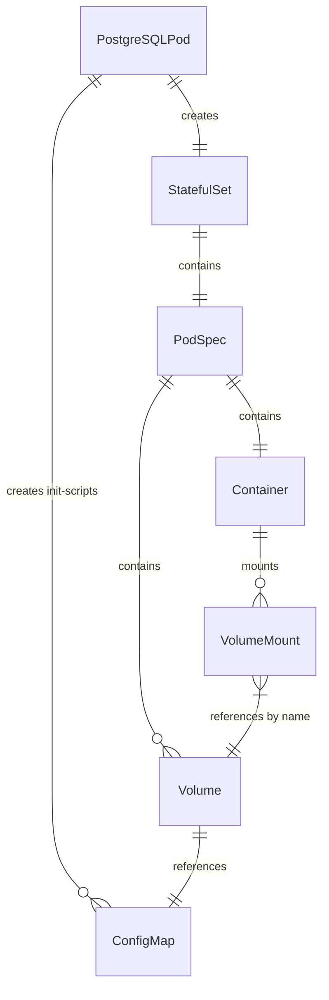

# Plan: Fix Init Script ConfigMap Mount Bug

**Priority:** Critical
**Effort:** Small
**Category:** Bug Fix
**Phase:** 1 - Critical Bug Fixes (Do First)
**Status:** ⏸️ DEFERRED

> **Note:** This plan is deferred because PostgreSQLPod does not yet exist in the codebase.
> This plan documents a design pattern that MUST be followed when implementing PostgreSQLPod
> to ensure init scripts are properly mounted. When PostgreSQLPod is implemented, incorporate
> these patterns directly into the implementation.

---

## Overview

Fix a critical bug where PostgreSQL init scripts are created as a ConfigMap but never mounted to the container, causing init scripts to silently fail to execute.

## Problem Statement

In the PostgreSQL pod implementation, `createInitScriptConfigMap()` creates a ConfigMap containing init scripts, but `buildMainContainer()` never mounts this ConfigMap as a volume.

**Result:** PostgreSQL init scripts will never execute because the files don't appear in `/docker-entrypoint-initdb.d/`.

### Root Cause

The implementation creates the ConfigMap resource but fails to:
1. Add a Volume referencing the ConfigMap to the pod spec
2. Add a VolumeMount to the container pointing to `/docker-entrypoint-initdb.d/`

## Proposed Solution

### 1. Add VolumeMount to buildMainContainer()

```java
@Override
protected Container buildMainContainer() {
    var builder = new ContainerBuilder()
        .withName("postgres")
        .withImage(image)
        .addNewPort().withContainerPort(5432).endPort()
        .withEnv(buildEnvVars());

    // Add init script volume mount if init scripts exist
    if (!initScripts.isEmpty()) {
        builder.addToVolumeMounts(new VolumeMountBuilder()
            .withName("init-scripts")
            .withMountPath("/docker-entrypoint-initdb.d")
            .withReadOnly(true)
            .build());
    }

    return builder.build();
}
```

### 2. Add Volume to Pod Spec

Override `applyPodCustomizations()` to add the ConfigMap volume:

```java
@Override
protected PodSpecBuilder applyPodCustomizations(PodSpecBuilder baseSpec) {
    baseSpec = super.applyPodCustomizations(baseSpec);

    // Add init scripts volume if needed
    if (!initScripts.isEmpty()) {
        baseSpec.addToVolumes(new VolumeBuilder()
            .withName("init-scripts")
            .withNewConfigMap()
                .withName(name + "-init")
            .endConfigMap()
            .build());
    }

    return baseSpec;
}
```

## Technical Considerations

- **Volume Name Consistency:** Use `"init-scripts"` consistently for both Volume and VolumeMount
- **ConfigMap Name Pattern:** Must match the name used in `createInitScriptConfigMap()`: `name + "-init"`
- **Mount Path:** PostgreSQL Docker images expect init scripts at `/docker-entrypoint-initdb.d/`
- **Read-Only Mount:** Init scripts should be mounted read-only for security
- **Ordering:** Volume must be added to pod spec before container references it

## Acceptance Criteria

### Functional Requirements
- [ ] ConfigMap volume is added to pod spec when init scripts exist
- [ ] VolumeMount points to `/docker-entrypoint-initdb.d`
- [ ] VolumeMount is read-only
- [ ] Init scripts execute on PostgreSQL startup
- [ ] No volume/mount added when `initScripts` is empty

### Quality Gates
- [ ] Integration test verifies init script creates expected database objects
- [ ] Test confirms volume mount path is correct
- [ ] Test confirms ConfigMap name matches

## Files to Modify

| File | Change |
|------|--------|
| `specs/02-postgresql-pod-implementation.md` | Update spec with fix |
| `core/src/main/java/org/testpods/core/pods/PostgreSQLPod.java` (future) | Implement fix when created |

## Test Plan

### PostgreSQLPodInitScriptTest.java

```java
@Test
void shouldExecuteInitScripts() {
    PostgreSQLPod postgres = new PostgreSQLPod()
        .withName("test-init")
        .withInitScript("01-create-schema.sql", "CREATE TABLE test_table (id INT);");

    postgres.start();

    try (Connection conn = postgres.getConnection()) {
        // Verify table was created by init script
        ResultSet rs = conn.getMetaData().getTables(null, null, "test_table", null);
        assertThat(rs.next()).isTrue();
    } finally {
        postgres.stop();
    }
}

@Test
void shouldMountInitScriptsVolume() {
    PostgreSQLPod postgres = new PostgreSQLPod()
        .withName("test-mount")
        .withInitScript("test.sql", "SELECT 1;");

    // Get the built pod spec before start
    PodSpec podSpec = postgres.buildPodSpec();

    // Verify volume exists
    assertThat(podSpec.getVolumes())
        .extracting(Volume::getName)
        .contains("init-scripts");

    // Verify volume mount in container
    Container mainContainer = podSpec.getContainers().get(0);
    assertThat(mainContainer.getVolumeMounts())
        .extracting(VolumeMount::getName, VolumeMount::getMountPath)
        .contains(tuple("init-scripts", "/docker-entrypoint-initdb.d"));
}

@Test
void shouldNotMountVolumeWithoutInitScripts() {
    PostgreSQLPod postgres = new PostgreSQLPod()
        .withName("test-no-init");

    PodSpec podSpec = postgres.buildPodSpec();

    assertThat(podSpec.getVolumes())
        .extracting(Volume::getName)
        .doesNotContain("init-scripts");
}
```

## MVP

### PostgreSQLPod.java (key sections)

```java
public class PostgreSQLPod extends StatefulSetPod<PostgreSQLPod> {

    private final Map<String, String> initScripts = new LinkedHashMap<>();

    public PostgreSQLPod withInitScript(String filename, String content) {
        initScripts.put(filename, content);
        return self();
    }

    @Override
    protected Container buildMainContainer() {
        ContainerBuilder builder = new ContainerBuilder()
            .withName("postgres")
            .withImage(image)
            .addNewPort().withContainerPort(5432).endPort()
            .withEnv(buildEnvVars());

        // Mount init scripts if present
        if (!initScripts.isEmpty()) {
            builder.addToVolumeMounts(new VolumeMountBuilder()
                .withName("init-scripts")
                .withMountPath("/docker-entrypoint-initdb.d")
                .withReadOnly(true)
                .build());
        }

        return builder.build();
    }

    @Override
    protected PodSpecBuilder applyPodCustomizations(PodSpecBuilder baseSpec) {
        baseSpec = super.applyPodCustomizations(baseSpec);

        if (!initScripts.isEmpty()) {
            baseSpec.addToVolumes(new VolumeBuilder()
                .withName("init-scripts")
                .withNewConfigMap()
                    .withName(name + "-init")
                .endConfigMap()
                .build());
        }

        return baseSpec;
    }

    @Override
    public void start() {
        ensureNamespace();

        // Create init script ConfigMap BEFORE StatefulSet
        if (!initScripts.isEmpty()) {
            createInitScriptConfigMap();
        }

        super.start();
    }

    private void createInitScriptConfigMap() {
        ConfigMap configMap = new ConfigMapBuilder()
            .withNewMetadata()
                .withName(name + "-init")
                .withNamespace(namespace.getName())
            .endMetadata()
            .withData(initScripts)
            .build();

        getClient().configMaps()
            .inNamespace(namespace.getName())
            .resource(configMap)
            .create();
    }
}
```

## ERD Diagram



## References

- Spec: `specs/refactorings/04-fix-init-script-configmap-mount.md`
- PostgreSQL Docker image docs: https://hub.docker.com/_/postgres (init scripts section)
- Implementation spec: `specs/02-postgresql-pod-implementation.md`
- Fabric8 VolumeMount docs: https://github.com/fabric8io/kubernetes-client/blob/main/doc/CHEATSHEET.md

---

## Validation Output

After implementation, write results to `specs/refactorings/04-fix-init-script-configmap-mount_result.md`
